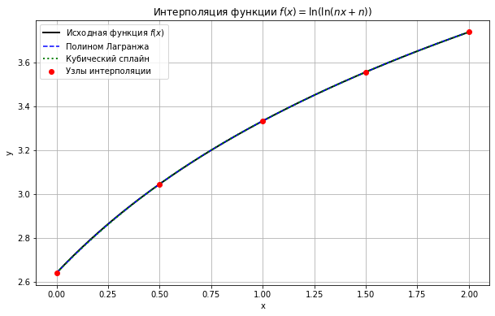
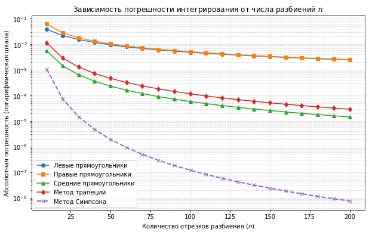
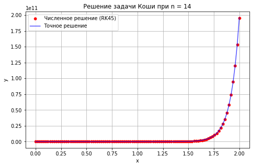

# Современные численные методы
## Расчетно - графическая работа

<div class="mt-20 text-sm text-gray-500">
  <strong>Студент:</strong> Секретов М. В.<br>
  <strong>Дата:</strong> 2026 г.<br>
  <strong>Учреждение:</strong> Кафедра прикладной математики и САПР<br>
  <strong>Преподаватель:</strong> к.т.н. Марихов И.Н.
</div>

<div class="pt-12">
  <span @click="$slidev.nav.next" class="px-3 py-1.5 border border-gray-300 rounded cursor-pointer hover:bg-gray-50 text-xs font-mono">
    СТАРТ &rarr;
  </span>
</div>

---
layout: default
---

## Задание 1. Анализ области определения функции

Проанализируем поведение функции $f(x) = \ln(x) + n \cdot x + 2$ на её естественной области определения $x \in (0, +\infty)$ при фиксированном значении параметра $n = 14$:

* **Монотонность:**
  Найдем первую производную заданной функции:
  $f^{\prime }(x)=\frac{1}{x}+n$
  При $n > 0$ и $x > 0$ производная всегда строго положительна ($f'(x) > 0$). Следовательно, функция строго возрастает на всей области определения и гарантированно имеет ровно один действительный корень.

* **Поведение на границах:**
  1. При $x \to 0^+$, слагаемое $\ln(x) \to -\infty$, следовательно, $\lim_{x \to 0^+} f(x) = -\infty$.
  2. При $x \to +\infty$, линейное слагаемое доминирует, и $\lim_{x \to +\infty} f(x) = +\infty$.

---
layout: default
---

## Задание 1. Применение условия Фурье

Для обеспечения сходимости метода Ньютона проверим выполнение условия Фурье ($f(x_0) \cdot f''(x_0) > 0$). Найдём вторую производную:
$f''(x) = -\frac{1}{x^2}$

Поскольку $f''(x) < 0$ при любых допустимых $x$, вторая производная всегда отрицательна. Чтобы условие выполнялось, необходимо выбрать начальное приближение $x_0$, в котором сама функция также принимает отрицательное значение ($f(x_0) < 0$).

* **Выбор начальной точки:**
  При выборе значения $x_0 = 0.011$ метод Ньютона будет приближаться к корню слева направо (строго монотонно снизу вверх). Это полностью исключает риск выхода итерационного процесса в недопустимую область определения функции ($x \le 0$).

---
layout: default
---

## Задание 1. Программная реализация метода Ньютона

```python
import scipy.optimize as opt
import numpy as np

def foo(x):
    n = 14
    return np.log(x) + n * x + 2

def df(x):
    n = 14
    return 1 / x + n

x0 = 0.011
toller = 1e-6

response, stats = opt.newton(foo, x0, fprime=df, tol=toller, full_output=True, maxiter=10)

print(f"Корень = {response:.7f}")
print(f"Количество итераций: {stats.iterations}")
```

**Результаты численного моделирования:**
* Рассчитанный корень уравнения: `0.0591364`
* Число затраченных итераций: `5`

---
layout: two-cols
class: text-left
slots:
  default:
    class: col-span-7
  right:
    class: col-span-5
---

## Задание 2. Интерполяция функции

Построение интерполяционной зависимости для $f(x) = \ln(nx + n)$ на отрезке $[0, 2]$ с шагом 0.5 ($n = 14$).

**Точность в контрольной точке $x = 0.66$:**

| Метод | Значение | Погрешность |
| :--- | :--- | :--- |
| **Точное** | 3.145875 | — |
| **Лагранж** | 3.146253 | $2.39 \cdot 10^{-4}$ |
| **Сплайн** | 3.146493 | $3.74 \cdot 10^{-4}$ |

<span class="text-[11px] text-gray-400 block mt-4">
  Характер сходимости аппроксимации в контрольных точках верифицирован в панели справа.
</span>

::right::
<div class="flex justify-center items-center h-full pl-4">
  <!-- Используем относительный путь ./ и инверсию/подложку под темную тему -->
  
</div>

---
layout: default
---

## Задание 2. Алгоритм интерполяции (Python)

```python
import numpy as np
from scipy.interpolate import lagrange, CubicSpline

def f(x, n=14): 
    return np.log(n * x + n)

# Formation of interpolation nodes
x_nodes = np.arange(0, 2.1, 0.5)
y_nodes = f(x_nodes)

# Building models
poly_lagrange = lagrange(x_nodes, y_nodes)
spline = CubicSpline(x_nodes, y_nodes)

x_test = 0.66
print(f"True: {f(x_test):.6f} | Lagrange: {poly_lagrange(x_test):.6f} | Spline: {spline(x_test):.6f}")
```

---
layout: two-cols
class: text-left
slots:
  default:
    class: col-span-7
  right:
    class: col-span-5
---

## Задание 3. Численное интегрирование

Вычисление определенного интеграла вида:
$\int_{0}^{1} (x^{14} + 1) dx$

Точное аналитическое значение интеграла: $I_{exact} = \frac{16}{15} \approx 1.066666666667$

**Погрешности методов при числе разбиений $N = 200$:**
* **Левые прям.:** 1.064195 (Погр: $2.47 \cdot 10^{-3}$)
* **Правые прям.:** 1.069195 (Погр: $2.53 \cdot 10^{-3}$)
* **Средние прям.:** 1.066652 (Погр: $1.46 \cdot 10^{-5}$)
* **Метод трапеций:** 1.066695 (Погр: $2.92 \cdot 10^{-5}$)
* **Метод Симпсона:** 1.066666 (Погр: $7.58 \cdot 10^{-9}$)

<!-- В Задании 3 (Интегрирование) -->
::right::
<div class="flex justify-center items-center h-full pl-4">
  
</div>

---
layout: default
---
## Задание 3. Численное интегрирование реализация алгоритма

```python
import numpy as np
import matplotlib.pyplot as plt

# 1. Определяем интегрируемую функцию
def f(x):
    return x**14 + 1

# Parameters
a = 0.0      # Нижний предел
b = 1.0      # Верхний предел
exact_value = 16 / 15  # Точное значение

# Массив разных значений N для исследования сходимости
n_values = np.arange(10, 201, 10)  # от 10 до 200 с шагом 10

# Списки для сохранения погрешностей
err_left, err_right, err_mid, err_trap, err_simp = [], [], [], [], []

# Цикл вычислений для разного количества разбиений
for n in n_values:
    h = (b - a) / n 
    x_nodes = np.linspace(a, b, n + 1)
    
    # Левые и правые прямоугольники
    rect_left = h * np.sum(f(x_nodes[:-1]))
    rect_right = h * np.sum(f(x_nodes[1:]))
    
    # Средние прямоугольники
    x_mids = x_nodes[:-1] + h / 2
    rect_mid = h * np.sum(f(x_mids))
    
    # Трапеции
    trapezoid = h * (0.5 * f(a) + np.sum(f(x_nodes[1:-1])) + 0.5 * f(b))
    
    # Симпсон
    simpson = (h / 3) * (f(a) + f(b) + 
                         4 * np.sum(f(x_nodes[1:-1:2])) + 
                         2 * np.sum(f(x_nodes[2:-2:2])))
    
    # Считаем абсолютную погрешность |Точное - Численное|
    err_left.append(abs(exact_value - rect_left))
    err_right.append(abs(exact_value - rect_right))
    err_mid.append(abs(exact_value - rect_mid))
    err_trap.append(abs(exact_value - trapezoid))
    err_simp.append(abs(exact_value - simpson))

print(f"Результаты при n = {n_values[-1]}:")
print(f"Метод левых прям.:     {rect_left:.12f} (Погрешность: {err_left[-1]:.2e})")
print(f"Метод правых прям.:    {rect_right:.12f} (Погрешность: {err_right[-1]:.2e})")
print(f"Метод средних прям.:   {rect_mid:.12f} (Погрешность: {err_mid[-1]:.2e})")
print(f"Метод трапеций:        {trapezoid:.12f} (Погрешность: {err_trap[-1]:.2e})")
print(f"Метод Симпсона:        {simpson:.12f} (Погрешность: {err_simp[-1]:.2e})")
```
---
layout: default
---

## Задание 4. Решение систем линейных уравнений

Исследуется система линейных алгебраических уравнений (СЛАУ) при $n = 14$:
$$
\begin{cases}
x + y + z = n \\
2x - y + z = 3 \\
x + y - z = 0
\end{cases}
$$

**Сравнительный анализ точности и сходимости:**

1. **Метод Гаусса (прямой метод):**
   * Получено точное решение: `[1.0, 6.0, 7.0]`
   * Норма ошибки: $0.00 \cdot 10^{00}$ (соответствует машинному уровню точности).
2. **Метод Якоби (итерационный метод):**
   * Данная система **не удовлетворяет** критерию достаточного диагонального преобладания.
   * Итерационный процесс расходится, что наглядно демонстрируется численным экспериментом:
     * Итерация 1: $x = [1.5, 14.0, 0.0]$
     * Итерация 5: $x = [3.0, 38.0, -21.0]$
     * Итерация 30: $x = [122881.0, 106502.0, 139271.0]$

---
layout: default
---

## Задание 4. Алгоритм решения СЛАУ на Python

```python
import numpy as np

# 1. Задаем исходную систему Ax = b
A = np.array([[1.0, 1.0, 1.0],
              [2.0, -1.0, 1.0],
              [1.0, 1.0, -1.0]], dtype=float)
b = np.array([14.0, 3.0, 0.0], dtype=float)

x_exact = np.linalg.solve(A, b)

# --- МЕТОД ГАУССА (Прямой метод) ---
def gauss_elimination(A_in, b_in):
    A = A_in.copy()
    b = b_in.copy()
    n = len(b)
    
    # Прямой ход
    for i in range(n):
        for j in range(i + 1, n):
            factor = A[j, i] / A[i, i]
            A[j, i:] -= factor * A[i, i:]
            b[j] -= factor * b[i]
            
    # Обратный ход
    x = np.zeros(n)
    for i in range(n - 1, -1, -1):
        x[i] = (b[i] - np.dot(A[i, i+1:], x[i+1:])) / A[i, i]
    return x

# --- МЕТОД ЯКОБИ (Итерационный метод с демонстрацией расходимости) ---
def jacobi_method(A_in, b_in, max_iter=30):
    n = len(b)
    x = np.zeros(n)  
    D = np.diag(A_in)
    R = A_in - np.diag(D)
    
    print("Первые итерации метода Якоби:")
    for it in range(max_iter):
        x_new = (b_in - np.dot(R, x)) / D
        if it < 5 or it == max_iter - 1:
            print(f"  Итерация {it+1}: x = {x_new}")
        x = x_new
    return x

x_gauss = gauss_elimination(A, b)
x_jacobi = jacobi_method(A, b)

print(f"\nТочное решение (NumPy):       {x_exact}")
print(f"Метод Гаусса:                 {x_gauss} (Ошибка: {np.linalg.norm(x_exact - x_gauss):.2e})")
print(f"Метод Якоби (НЕ сошелся):     {x_jacobi}")
```

---
layout: two-cols
class: text-left
slots:
  default:
    class: col-span-7
  right:
    class: col-span-5
---

## Задание 5. Решение обыкновенных дифференциальных уравнений

Решение задачи Коши для линейного ОДУ первого порядка:
$y' = y \cdot (14 - x), \quad y(0) = 1$

Численное интегрирование выполнено методом Рунге-Кутты 4-го порядка (адаптивный алгоритм RK45).

**Аналитическое решение задачи:**
$y_{exact}(x) = \exp\left(14x - \frac{x^2}{2}\right)$ <br>
Ответ полученный после работы алгоритма:
* Старт x=0: Численное=1.0000 | Точное=1.0000
* Финиш x=2: Численное=1.9541e+11 | Точное=1.9573e+11

<span class="text-[11px] text-gray-400 block mt-2">
  Сопоставление полученных численных значений со сплошной теоретической кривой верифицировано в блоке справа.
</span>

<!-- В Задании 5 (ОДУ) -->
::right::
<div class="flex justify-center items-center h-full pl-4">
  
</div>

---
layout: default
---

## Задание 5. Реализация алгоритма решения ОДУ на Python

```python
import numpy as np
from scipy.integrate import solve_ivp

# 1. Параметры задачи
n = 14
x_start = 0
x_end = 2  
y0 = [1]   # Начальное условие y(0) = 1

# 2. Определение правой части дифференциального уравнения
def ode_func(x, y):
    return y * (n - x)

# 3. Численное решение методом Рунге-Кутты 4-го порядка (RK45)
x_fine = np.linspace(x_start, x_end, 100)
solution = solve_ivp(ode_func, [x_start, x_end], y0, method='RK45', t_eval=x_fine)

# 4. Точное решение для сравнения
y_exact = np.exp(n * x_fine - (x_fine**2) / 2)

print(f"Старт x=0: Численное={solution.y[0][0]:.4f} | Точное={y_exact[0]:.4f}")
print(f"Финиш x=2: Численное={solution.y[0][-1]:.4e} | Точное={y_exact[-1]:.4e}")
```